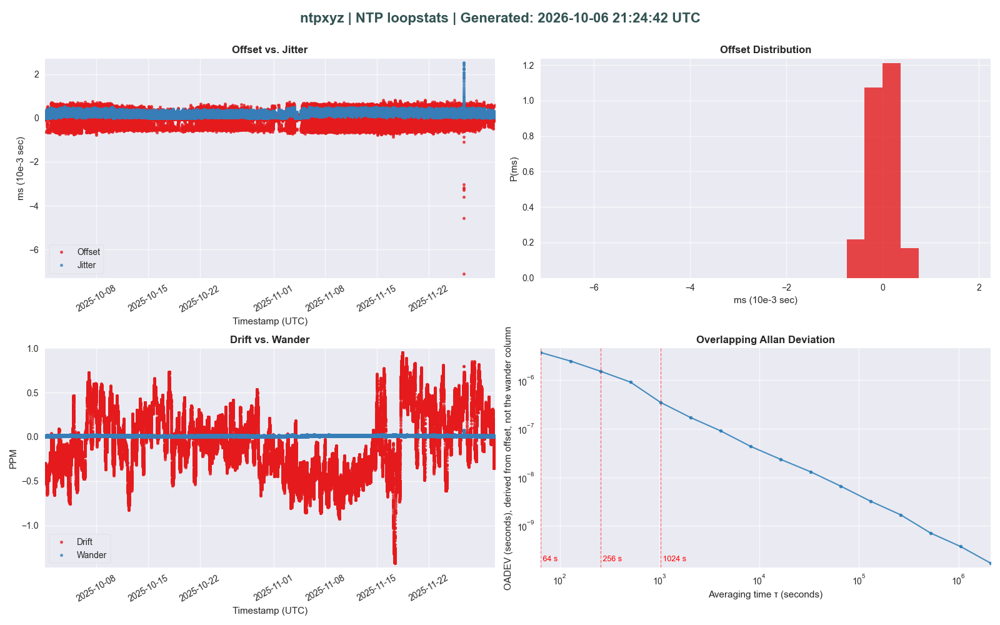
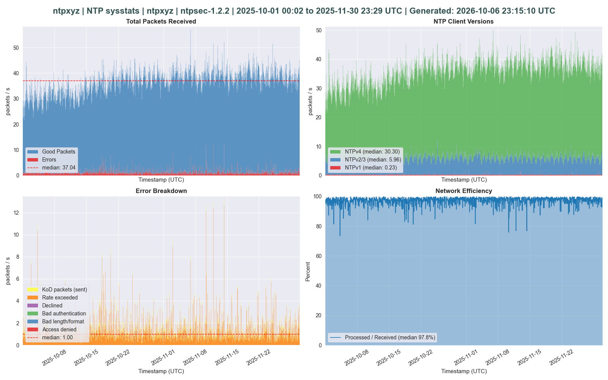
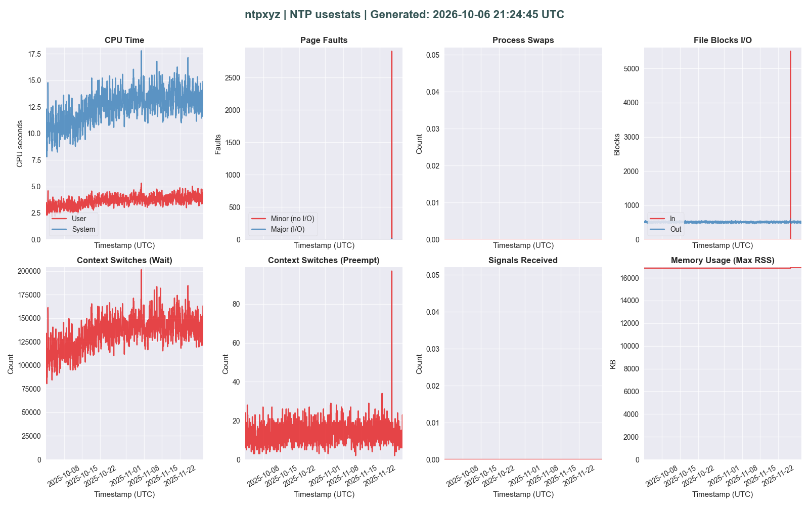

# ntpxyz: The NTP Statistics Toolkit

ntpxyz is a lightweight Python tool for parsing and visualizing statistics from NTP servers. It processes standard NTP stats logs—currently loopstats (clock sync), sysstats (network traffic), and usestats (host utilization)—then generates clear, insightful plots using Matplotlib. Designed for both interactive use and automated batch runs, ntpxyz helps monitor NTP server health with minimal fuss.

Whether you're troubleshooting sync issues, analyzing traffic patterns, or checking resource usage, ntpxyz turns raw logs into actionable visuals. It supports command-line options, JSON configs for defaults, and even Telegram notifications for remote or DMZ setups.

[](https://badge.fury.io/py/ntpxyz)  <!-- Placeholder; update post-PyPI -->
[](https://opensource.org/licenses/MIT)

## Example Plots

### loopstats



### sysstats



### usestats



## Features

- **Supported Stats**: Loopstats (offset, drift, Allan deviation), sysstats (packets, errors, efficiency), usestats (CPU, memory, I/O).
- **Flexible Input**: Parse single files or scan directories; filter by rolling periods (e.g., last week, month).
- **Output Options**: Save plots as PNG, PDF, or SVG; send via Telegram for unattended alerts.
- **Configurable**: CLI flags or `~/.config/ntpxyz/config.json` for overrides (e.g., save dir, Telegram tokens).
- **Robust**: Handles date conversions from NTP's MJD format; basic validation and error logging.

Roadmap includes more stats types, better date filtering, data exports, and comparisons—see [roadmap.md](docs/roadmap.md) for details.

## What's new in 0.1.3

The packet charts finally did the division. A count of 120,000 in an hour is about 33 a second, and the axis says so. The CPU title says what fraction of the hour those seconds were, without pretending they were a percent. Details, including the 0.1.2 note about 13-column files, are in [changelog.md](docs/changelog.md).

## What's new in 0.1.2

The short version: the charts stopped making things up.

If your sysstats file has 13 columns, add `--dialect ntpd-4.2.8` or `--dialect ntpsec-1.2.1`. Two different NTP programs write that width and mean different things by the middle column. Fourteen columns do not need the hint.

The CPU chart used to pretend seconds were percents. Offset used to throw away its sign, so "fast" and "slow" looked identical. Both of those habits are gone. The rest is in [changelog.md](docs/changelog.md), written for humans.

## Installation

ntpxyz requires Python 3.11+. Install via pip:

```bash
pip install ntpxyz
```

From source (clone and install editable for dev):

```bash
git clone https://github.com/brontsor/ntpxyz.git
cd ntpxyz
poetry install  # Or pip install -e .
```

Dependencies: allantools, matplotlib, numpy, pandas, requests (all handled by Poetry/pip).

## Usage

Run with `ntpxyz` (or `python -m ntpxyz`). Provide at least one input source: `--loadconfig`, `--scandir`, or `--scanfile`.

```text
usage: ntpxyz [-h] [-c CFG] [-p TIME] [-s DIR] [-f FMT] [-n NAME] [-d DIR] [-l FILE]
              [-y TYPE] [-t] [-v 1-5] [--version] [--dialect DIALECT]

ntpxyz - The NTP Statistics Toolkit

options:
  -h, --help            show this help message and exit
  -v, --verbose 1-5     logging level, 1 critical to 5 debug. Not --version.
  --version             show program's version number and exit
  --dialect DIALECT     required for 13-column sysstats: ntpd-4.2.8 or ntpsec-1.2.1
  -c, --loadconfig CFG  load values from ConFiG file (e.g., ~/.config/ntpxyz/config.json)
  -p, --period TIME     specify a TIME period for scandir (e.g., rolling-week)
  -s, --savedir DIR     DIRectory to save output files (default: current dir)
  -f, --saveformat FMT  ForMaT of output: pdf, png, svg (default: png)
  -n, --savename NAME   prefix for output file NAME (default: ntpxyz)
  -d, --scandir DIR     scan a DIRectory for stats files and parse all valid matches
  -l, --scanfile FILE   path to a specific ntp statistics FILE (overrides scandir)
  -y, --statstype TYPE  override detected stats type: loopstats, sysstats, usestats
  -t, --telegram        send plot(s) to Telegram (requires config with chat_id/telegram_token)

One of --loadconfig, --scandir, or --scanfile is required. CLI flags override config values.
```

### Examples

Process a directory of logs for the last week:

```bash
ntpxyz --scandir /var/log/ntpstats --period rolling-week --saveformat png
```

This scans for all supported stats types, generates plots, and saves them in the current directory as `ntpxyz_loopstats.png`, etc.

Load from config and send to Telegram:

```bash
ntpxyz --loadconfig ~/.config/ntpxyz/config.json --telegram
```

Example `config.json`. Note that passing in an option via CLI overrides the config file value.

```json
{
  "scandir": "/var/log/ntpstats",
  "period": "rolling-month",
  "telegram_token": "your-bot-token",
  "chat_id": "your-chat-id",
  "telegram": true
}
```

Single file with custom name:

```bash
ntpxyz --scanfile /var/log/ntpstats/loopstats.202601 --savename my_ntp_plots
```

For setup details on Telegram, see [telegram_setup.md](docs/telegram_setup.md).

### Known Limitations

- A 13-column sysstats file needs `--dialect`. Without it, ntpxyz refuses to guess.
- Periods only apply to `--scandir`.
- Telegram may hit file size limits for PDFs; use PNG.
- More stats types (e.g., peerstats) in future releases.

Example outputs and logs: Check the `examples/` directory for sample data and plots.

## Contributing

Contributions welcome! Fork the repo, create a feature branch (`git checkout -b feature/my-addition`), commit atomically, and open a PR. Run `pre-commit run --all-files` before pushing.

Install dev deps: `poetry install --only dev`.

Test: `poetry run pytest`.

Lint/Typecheck: `poetry run ruff check .`, `poetry run mypy .`, `poetry run pyright`.

See [roadmap.md](docs/roadmap.md) for priorities.

## License

MIT License—see [LICENSE](LICENSE) for details.

---

Questions? Open an issue or reach out. Happy wandering!
